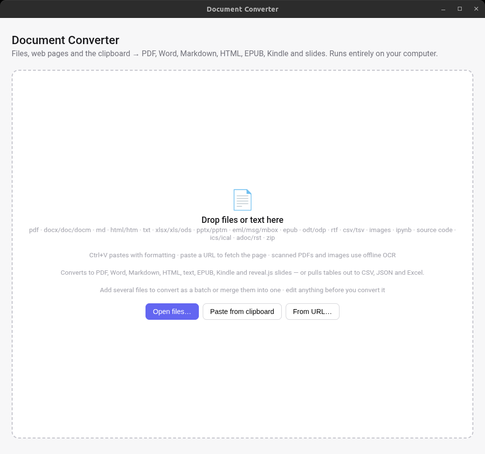
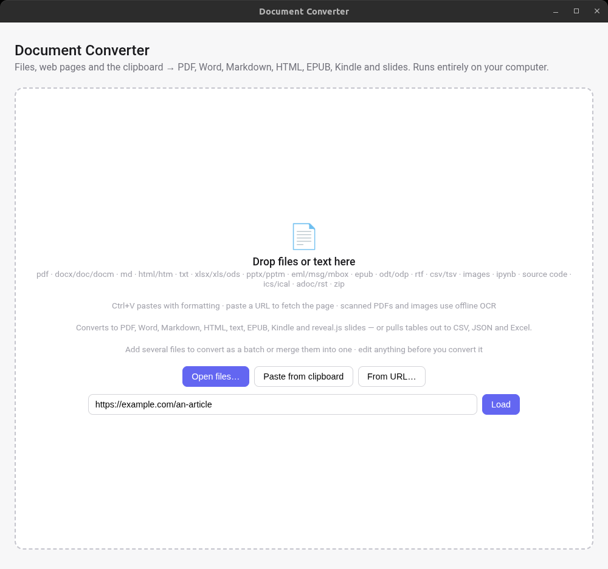
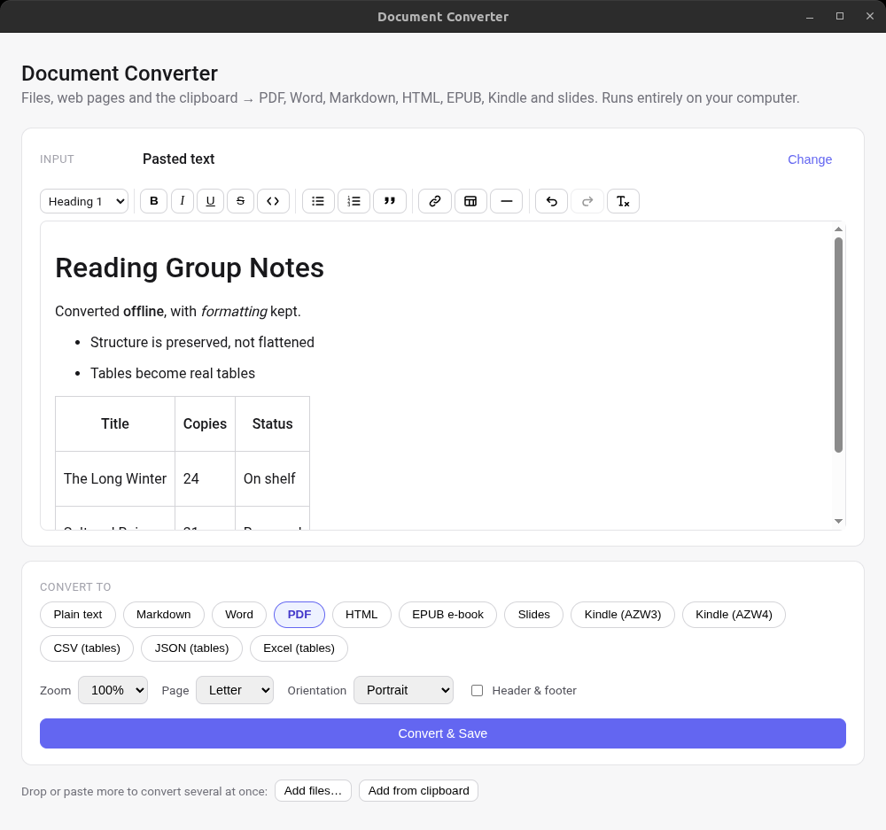
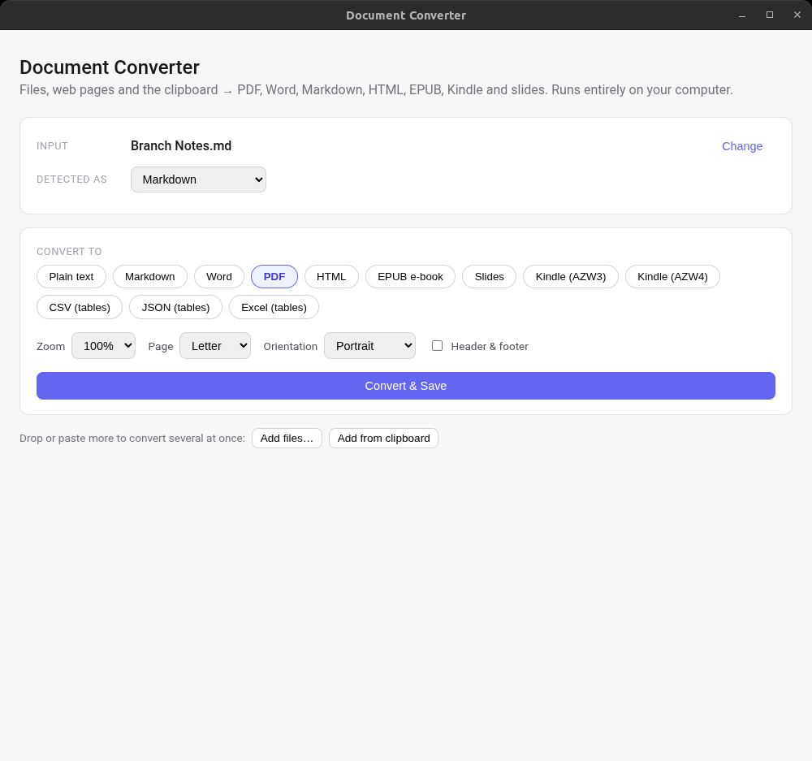

# Document Converter

Convert documents between 22 input formats and 12 output formats on your own
machine. Your documents are never uploaded, there is no account and no
telemetry. The app makes network requests only when you ask it to: fetching a
web page you paste, along with the images on it, and downloading an OCR
language pack you select.




Online converters upload the file you give them. This one does the conversion
locally, and the code that does it is in this repository.

---

## Contents

- [Install](#install)
- [What it reads](#what-it-reads)
- [What it writes](#what-it-writes)
- [What it is good at](#what-it-is-good-at)
- [What it deliberately does not do](#what-it-deliberately-does-not-do)
- [Batch and merge](#batch-and-merge)
- [Command line](#command-line)
- [Development](#development)
- [Project layout](#project-layout)
- [Licence](#licence)

## Install

Download the release for your platform:

| Platform | File |
| --- | --- |
| Windows x64 | `docconversion-<version>-setup.exe` |
| Linux x64 | `docconversion-<version>.AppImage` |
| macOS x64 | `Document Converter-<version>-mac.zip` |

The builds are **not code signed**. Windows SmartScreen will warn on first run —
choose *More info* then *Run anyway*. On Linux, mark the AppImage executable
with `chmod +x` before running it. On macOS, Gatekeeper refuses an unsigned app
on first launch: right-click it and choose *Open*, or clear the quarantine
attribute with `xattr -d com.apple.quarantine "Document Converter.app"`.

The macOS build is x64 only; Apple Silicon runs it under Rosetta 2.

## Screenshots

| Paste a URL | Edit before converting | Choose the output |
| --- | --- | --- |
|  |  |  |

Anything pasted or fetched opens in an editor first, so you can trim it before
converting. Pasted Markdown arrives as formatted text, not as raw syntax.

## What it reads

The internal names are in `SOURCE_FORMATS` in `src/core/types.ts`:

```
txt, md, docx, pdf, html, eml, msg, csv, xlsx, rtf, image, code,
ipynb, pptx, doc, epub, mbox, odt, odp, ics, asciidoc, rst
```

Some of those names cover more than one file extension.

- **Word.** `.docx` and `.docm` are read fully. `.doc` (Word 97 to 2003) is read
  for its text only, and the app tells you what it could not recover.
- **Spreadsheets.** `xlsx` covers `.xlsx`, `.xls` and `.ods`.
- **Presentations.** `pptx` covers PowerPoint, `odp` covers OpenDocument slides.
- **Email.** `.eml`, `.msg` (Outlook) and `.mbox` archives.
- **Images.** `.png`, `.jpg`, `.gif` and `.webp`. Embed the image in the output,
  or run text recognition on it.
- **Source code.** 32 extensions, listed in `EXT_TO_LANG` in
  `src/core/code-langs.ts`, syntax highlighted in the output.
- **Notebooks.** `.ipynb` rendered with `In [n]:` / `Out[n]:` prompts, with
  code, output and errors styled differently.
- **Markup.** `.adoc` / `.asciidoc`, and `.rst`.

Three inputs are not file formats:

- **The clipboard.** Ctrl+V or *Paste from clipboard*. Formatting from Teams,
  Word and Outlook survives, including tables, links and images.
- **A web page address.** Paste a link or use *From URL*. The readable article
  is extracted with Mozilla Readability and images inlined up to a size budget.
  Every redirect hop is checked against private and loopback addresses, so a
  page cannot make the app fetch something on your local network.
- **A ZIP archive.** Expanded into its convertible entries, each becoming a
  separate input. Junk entries such as macOS resource forks are skipped, with a
  cap of 100 entries.

Drop files anywhere in the window, including onto a list you have already
loaded.

## What it writes

The output formats are in `TARGET_FORMATS` in `src/core/types.ts`:

```
txt, md, docx, pdf, html, epub, revealjs, azw3, azw4, csv, json, xlsx
```

**Documents**

- **txt** — plain text.
- **md** — Markdown with GitHub-style pipe tables.
- **docx** — a Word document.
- **pdf** — rendered by Chromium. Zoom 50–200%, page size (Letter, A4, Legal,
  A3, Tabloid), orientation, and an optional header and footer with the title,
  date and page numbers.
- **html** — one standalone file.
- **epub** — an e-book. Chapters split on the document's own headings, images
  stored once each, markup written as XHTML because e-book readers require
  well-formed XML.

**Slides**

- **revealjs** — a [reveal.js](https://revealjs.com) deck as a single
  self-contained HTML file. Slides are separated by a horizontal rule (`---` in
  Markdown) or by a heading level you choose. Speaker notes written as
  `<!-- notes: ... -->` reach reveal's speaker view.

**Kindle**

- **azw3** — a reflowable Kindle e-book (KF8), built from the same content as
  the EPUB output.
- **azw4** — a Kindle print replica: your PDF in a Kindle container. It does not
  reflow, so it is rendered at Kindle page size regardless of the page setup you
  chose: a Letter page shown on a 6-inch screen puts the text at roughly a third
  of its intended size.

**Tables** (`TABLE_TARGETS`)

- **csv** — one file per table found in the document.
- **json** — one file per table, keyed by the header row when there is one.
- **xlsx** — one workbook, one sheet per table.

There is also a *Convert to clipboard* button, which puts both a rich HTML and a
plain text version on the clipboard. It is hidden for outputs whose bytes are
not text (Word, PDF, EPUB, Excel, Kindle), and for slide decks, which are a
complete HTML document with about 240 KB of JavaScript inlined.

## What it is good at

**Tables.** Recovered from every source that carries one — the easy cases (HTML,
Markdown, spreadsheets, CSV) and the hard ones:

- A PDF has no table structure, only text and its position, so the grid is
  inferred from the geometry. On the test corpus this recovers 408 of 409 rows
  across 20 tables, with no false tables on a 70-page document of ordinary
  prose.
- The same inference runs on text-recognition output, so a scanned table can
  become a CSV file.
- RTF tables are parsed from the control words, and nested tables stay nested.
- reStructuredText simple tables, grid tables and column spans use ports of
  docutils' own algorithms.
- A `.txt` file whose columns are separated by tabs is read as a table.

**Text recognition.** A PDF with no text layer, or an image, is read with
tesseract.js, offline, in a separate process. English ships with the app; 24
further languages are downloaded only when you ask for one, verified by
checksum, and stored alongside it. The confidence threshold is set per script, and no
uncalibrated script is given a lower threshold than English, which was
measured.

**Images in PDFs.** Extracted and placed back into the output in reading order.

**Large tables in PDF output.** Chromium's `printToPDF` refuses documents above
a size that depends on the shape of the content, and clips wide tables with no
warning and no error. Large tables are split across several print calls and the PDFs
joined, repeating the header row on each part.

**Page fit advice.** Before printing, the app estimates how wide the widest
table needs to be, and suggests the smallest page setup that fits. It suggests rather than
changes the setting, because changing your page setup without telling you would
be a second defect rather than a fix for the first.

**Merging.** Several inputs into one document. When the output is PDF and the
inputs are PDFs, pages are copied straight across rather than re-rendered, so
text layers, images and scanned pages survive unchanged.

## What it deliberately does not do

Most of the limits below are choices rather than gaps.

**It does not reproduce layout.** This converts content, not appearance. Fonts,
margins, columns and exact spacing are not carried across. If you need the
output to look like the input, this is the wrong tool.

**It does not guess at a table it cannot read.** A wrong table is worse than no
table, because it silently reorders the document's content.

- Grid inference declines when the geometry is not convincing; the PDF
  confidence floor is 0.75.
- Text recognition passes three separate checks before its output becomes a
  table. A paragraph of prose looks like a grid when all you have is the
  position of each word — one became a 17-column table before those checks
  existed.
- A `.txt` file whose columns are aligned with spaces is not read as a table.
  Indented code and aligned prose cannot be told apart from columns without
  understanding the text.
- A `.doc` file produces no tables. The old Word format keeps a marker at the
  end of each cell but no column geometry, so the grid cannot be rebuilt. The
  cell markers are made visible as ` | ` instead, which shows where the cells
  divided without asserting a column structure that cannot be determined.

**It reports what it could not recover from a `.doc`.** Tables, numbered lists
and embedded pictures are named, with a suggestion to re-save as `.docx`. It
does not invent numbering and does not emit a placeholder where a picture was.
The picture bytes are recoverable; their positions are not.

**Table cells lose inline formatting in Markdown output.** Tables are rebuilt
from a plain-text grid, which is what stops a cell containing `|` corrupting the
table.

**Some structure cannot be recovered.** Recorded so they are not reported again
as bugs:

- A PDF paragraph crossing a page break stays two paragraphs; paragraphs are
  built one page at a time.
- A PDF sub-heading that differs from body text only by being bold stays a
  paragraph — the PDF library reports glyph height, which bold does not change.
- OpenDocument numbered lists are written unnumbered; the numbering style lives
  in a part of the file the reader does not load.
- HTML `<style>` blocks are not interpreted, so an element hidden by a
  stylesheet is still converted.
- Word tab-stop positions cannot be reproduced. Tab stops stay visible so
  nothing runs together.

**Links pointing inside the same document are dropped.** The internal HTML
carries no element IDs, so such a link has no destination after conversion. The
link is removed and its text kept, because a link with no destination is worse
than plain text. See
`docs/superpowers/specs/2026-09-01-epub-output-and-anchors-design.md`.

**No auto-update.** The app does not check for updates and contains no updater.
There is deliberately no `publish` section in `electron-builder.yml`, so no
update endpoint is written into the packaged app.

**macOS ships as an unsigned zip only.** The `.app` is cross-built from Linux,
which is enough for the zip target but not for a `.dmg` (`hdiutil` is macOS-only)
and not for signing or notarisation (`codesign` likewise). There is no Apple
Developer certificate and no macOS build machine, so Gatekeeper will always
challenge it. An arm64 build would need `@napi-rs/canvas-darwin-arm64` installed
before packaging, for the reason given under Packaging.

**Out of scope.** `.ppt` (the old binary PowerPoint format, with no usable
JavaScript reader), `.odg`, LaTeX, `.pst` archives, and converting email
attachments recursively.

## Batch and merge

Load several inputs by dropping more files, or with *Add files* and *Add from
clipboard*, then choose a mode.

- **Batch** converts each input separately into a directory you choose. You get
  a result per file, can retry one that failed, and cancelling marks the rest as
  cancelled.
- **Merge** joins everything into one document. Each source gets a heading with
  its name, which you can turn off, and a page break is always inserted between
  sources.

The csv, json and xlsx outputs are excluded from merge, since they produce one
file per table and are per-file work by definition.

## Command line

```
docconv convert <inputs...> --to <txt|md|docx|pdf|html|epub|revealjs|azw3|azw4|csv|json|xlsx>
  [--out <fileOrDir>] [--from <format>] [--merge] [--no-headings] [--table N]
  [--split <auto|hr|h1|h2>] [--scale 1.25] [--page A4] [--landscape]
  [--header-footer] [--ocr] [--no-clobber] [--help] [--version]
```

The launcher is installed at `<install>/resources/cli/docconv`. In a development
checkout, run `npm run cli -- <args>`.

- `--out` names a file, and its extension is honoured. Given a directory, names
  are derived from the inputs. Given no extension, the target's is appended.
- Output files are overwritten by default so a script gets a predictable path.
  `--no-clobber` refuses instead.
- `--scale` must be between 0.1 and 2.0; a value outside that is rejected rather
  than clamped.
- `--table N` picks one table, for csv and json output only.
- `--split` chooses where a new slide starts, for the `revealjs` target.
- `--merge` cannot be combined with csv, json or xlsx.
- More than one input requires `--out`.
- Exit code 0 when everything succeeded, 1 when anything failed, 2 when the
  arguments were wrong.
- On Linux, PDF output needs a display server — run under `xvfb-run` if headless.

## Development

```
npm install
node scripts/fetch-ocr-assets.mjs   # one time: downloads the English OCR data
npm run dev                         # launch with hot reload
npm test                            # unit tests
npm run typecheck
```

Two tests are skipped by default: the visual and EPUB-corpus harnesses, which
run only when their environment variables are set.

### Looking at the output

A passing test suite is not evidence that a document converts correctly. A
string assertion cannot see an `` tag printed as visible text, two words
run together, or a table clipped off the edge of the page. All three shipped
past a green suite and were found by rendering a document and looking at it.

For any change affecting layout, render one and read it:

```
VISUAL_FILES="a.pptx|b.ipynb" VISUAL_OUT=/tmp/v npx vitest run tests/tools
npx electron scripts/print-pdf.cjs /tmp/v/a.html /tmp/v/a.pdf
```

`VISUAL_TARGET` sets which output format the page is styled for (default `pdf`).
`tests/tools/epub-corpus.test.ts` does the same for e-books via `EPUB_FILES`
and `EPUB_OUT`.

### Test fixtures

`tests/corpus/` holds synthetic documents built by generators in
`scripts/fixtures/`, so a fresh clone is self-contained. They are built to
reproduce the *structural property under test* rather than to look realistic —
a fixture that passes without exercising the property is worse than none.

### End-to-end

```
npm run test:e2e -- <outDir> tests/fixtures/sample.docx ...
npm run build && npm run test:cli
npm run screenshots                 # regenerate docs/screenshots
```

The first converts every fixture to every output format inside a real Electron
main process, then checks the result by reading it back through the app's own
readers.

### Packaging

```
npm run build:win     # NSIS installer -> dist/docconversion-<version>-setup.exe
npm run build:linux   # AppImage       -> dist/docconversion-<version>.AppImage

# macOS: install the target's Skia first, then package the zip only.
# A bare `--mac` also tries .dmg, which needs macOS.
node scripts/native-for-target.mjs darwin-x64
npx electron-builder --mac zip   # -> dist/Document Converter-<version>-mac.zip
```

`files:` in `electron-builder.yml` is an **allowlist**. It was once a list of
exclusions, which left electron-builder's default `**/*` in force and packaged
the entire working directory.

Cross-building needs the target's native binding — `@napi-rs/canvas` ships one
per platform and npm installs only the host's, so a Windows package built on
Linux silently produced PDFs with no images. `prebuild:win` fetches it; the
macOS command above does the same by hand. Installing one target's binding
removes the previous one, so rebuild a platform after switching. Building each
platform on its own runner is the real fix.

## Project layout

- `src/core/` — the conversion logic. No Electron dependency, covered by unit
  tests.
  - `readers/` — one file per input format, plus `url.ts` and the shared
    `odf-common.ts` / `email-common.ts`.
  - `writers/` — one file per output format.
  - `detect.ts` — decides what an input is, via ordered rules returning either a
    format or a reason it is unsupported.
  - `allowlist.ts` — the single list of HTML tags and attributes the internal
    document may contain. The editor's schema must model every one of them.
  - `grid-infer.ts`, `table-grid.ts` — find and extract tables.
  - `page-fit.ts`, `html-chunk.ts` — estimate fit, and split a large table for
    printing.
  - `slides.ts` — cuts the document into slides.
  - `merge.ts`, `pdf-merge.ts` — join documents, and join PDFs page for page.
  - `net/guarded-fetch.ts` — the fetcher that refuses private addresses.
- `src/ocr/` — the recognition pipeline, the language catalogue, and
  checksum-gated pack installation. No Electron dependency.
- `src/cli/` — argument parsing and output-path resolution. No side effects.
- `src/main/` — the Electron main process: IPC handlers, dialogs, conversion
  orchestration, the recognition host, and the headless CLI runner.
- `src/preload/` — the typed `window.api` bridge. Context isolation on, Node
  integration off.
- `src/renderer/` — the React interface.
- `docs/superpowers/` — design specs and implementation plans.

## Licence

[MIT](LICENSE) © Stephen Genusa

reveal.js is MIT © Hakim El Hattab and contributors. OCR language data is from
the [tesseract-ocr](https://github.com/tesseract-ocr) project under the Apache
2.0 licence.
